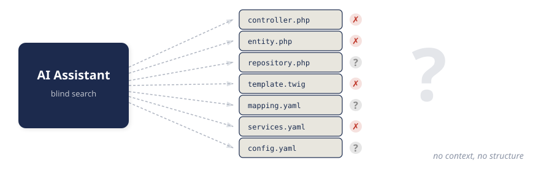
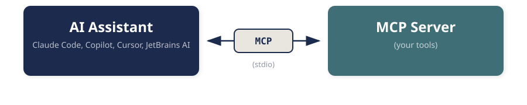

<!-- _class: teal -->

# SYMFONY MATE

<div class="subtitle">Giving your AI assistant eyes</div>

<div class="speaker-info">Johannes Wachter with Roland Golla — Never Code Alone | 2026-08-04</div>

---

## The blind spot

AI assistants are not missing a **capability**. They are missing **context at the right
moment**.

They read your code. They never see what your application *does*:

- no profiler
- no logs
- no container
- no service definitions

They see the blueprint. Never the building in operation.

---

## What happens when the AI has to guess



Prompt: *“This page is slow, find the performance problem.”*

The agent reads controllers, entities, repositories, templates, mappings,
services, config — **it has to**, because the problem can sit in any layer.

---

## Why guessing does not scale

At 15 files this works fine. At thousands it does not.

- **Not deterministic** — same prompt, different result
- **Not scalable** — every file costs tokens, including the ones that are only noise
- **Not repeatable** — restart, new answer

> “Ask two doctors about your health and you get three answers.
> That is exactly the problem we have with agents today.”

---

## What Mate is

A **development-only** tool that hands the inside view of a running Symfony
application to the assistant.

- Runs **locally**, on your machine
- **Has no business in production** — that is not a warning, that is the design
- Framework-agnostic, with Symfony as a first-class citizen
- Its own DI container, **separate** from your application

That is why Mate still helps when your container is *broken* —
a missing parameter definition does not take Mate down with it.

---

## The building blocks: tools and resources



- **Tools** — questions the agent asks: “which queries did this request run?”
- **Resources** — data it reads: a profile, a container excerpt, a log

Both are **PHP classes** in the end. No framework inside the framework.

---

<!-- _class: live-demo -->

# LIVE

## The N+1 with 101 queries

`demo/` in this repository

---

## Without Mate

```bash
claude --strict-mcp-config
```

The same question, without a tool:

1. The agent crawls the directory
2. looks for structure, framework, controllers, entities
3. reads `index.html.twig`, `BlogController`, `PostRepository` …
4. reconstructs your application **from nothing**

It finds it. The example is small enough.

**The question is not *whether*, but *how*.**

---

## With Mate — three commands

```bash
composer require --dev symfony/ai-mate symfony/ai-symfony-mate-extension
vendor/bin/mate init
vendor/bin/mate discover
```

```bash
claude --strict-mcp-config --mcp-config mcp.json
```

New session, same question — Mate is the only difference.

The agent goes to the profiler. Gets the token. Loads the profile.
Sees: **101 queries, 100 of them identical.**

After that it reads *exactly the* files that matter.

---

## Why that worked

The profiler tells the agent immediately: *here are 100 identical queries.*

And the best part: **it looks human.**
It is the same path a Symfony developer takes — look at the tool first,
then reach for the right spot.

Not understanding the whole application from scratch. Every single time.

---

## Your own extensions


Only **your** project knows your domain. So bring it in as a tool:
DI support, `#[McpTool]`, done.

Reusable? → **MatesOfMate**: PHPUnit, PHPStan, Composer, Sulu, Database.

> Extension authors do not build commands. They **curate context.**

---

## Skills: the knowledge layer

*Having* a tool does not mean knowing *when* to use it.

```markdown
---
name: symfony-profiler-debugging
description: When and how to use the profiler
---
<!-- the body is only loaded once the description matches -->
```

- The **description** is always in context — a few lines
- The **instructions** only on a match — progressive disclosure

The tool is the *ability*. The skill is the *knowing when*.

---

## Context is a budget

MCP costs tokens. Every tool description, every response. That is true.

But the alternative costs **more**: without a tool the agent crawls
files, and most of that is noise.

Measured (as of April 2026): Mate itself costs around **2,000–2,500 tokens**.

> Frugality is therefore not fine-tuning, it is a **design principle**.
> The quality of the tool decides whether you gain or waste.

---

## Redaction: what the agent must not see

The container holds API keys. Query parameters hold tokens.
Log context holds session data.

Mate redacts **by default**, not on request.

And: newly installed extensions are discovered automatically,
but can be switched off at any time. You do not have to keep an eye
on half your `vendor/`.

---

## What is next

- **Knowledge as an extension** — docs for the *installed* version instead of guessing online
- **Skills as a specification** — not just “how do I use this tool”
- **Distribution without dependency conflicts** — PHAR? Something else?
- **Does a tool like this have to be an MCP server at all?**

---

## The last question — open

In Berlin this slide still said: *“Why MCP, not just a CLI?”*
The answer back then: because a CLI makes the agent **guess** — it does not
know the parameters or the output format.

That is exactly the gap **skills** close.

If that holds, the transport question is no longer a matter of belief,
but a **matter of measurement**.

---

<!-- _class: teal -->

## The core message

If AI assistants are going to help with real software problems,
do not give them **more** context.

# Give them **better** context.

---

## Resources


### github.com/wachterjohannes/nca-mate

- **Symfony Mate** — github.com/symfony/ai
- **Berlin talk (slides + demo)** — github.com/wachterjohannes/symfony-mate-berlin
- **Articles** — johanneswachter.dev/blog:
  *Giving AI assistants eyes* · *Skills over MCP* ·
  *The wrong debate (MCP vs. CLI)*
- **MatesOfMate** — github.com/MatesOfMate

In this repo: `demo/` = the N+1 case to follow along, `slides.md` = these slides.

---

## Backup: the run without Mate

Recorded during the rehearsal, 2026-08-02, Fable 5. Translated from the German
prompt that was used in the recorded run.

```text
❯ The page is slow. Find the performance problem.

⏺ “…my first guess is an N+1 query problem.”
⏺ find src -type f -name "*.php"
⏺ Read src/Controller/BlogController.php
⏺ Read templates/blog/index.html.twig
⏺ Read src/Entity/Post.php
⏺ grep src/DataFixtures/AppFixtures.php
```

Result: *“the front page runs 1 + 100 = 101 queries”* —
**calculated** from four files. Correct, but a calculation.

---

## Backup: the run with Mate

Same question, a different path.

```text
⏺ symfony-profiler-list          → the last requests
⏺ symfony-profiler-get f446c9    → the profile of the front page
⏺ read profile/f446c9/db
     query_count: 101 — 100 of them identical:
     SELECT … FROM comment WHERE post_id = ?
     sample_params: "***REDACTED***"
⏺ grep src/ → Read src/Controller/BlogController.php
```

**Measured** instead of calculated: 101 queries, 1.48 ms in the database —
and redaction was on the whole time.

Both runs: ~40 seconds, ~75k tokens. **The difference is the path.**
