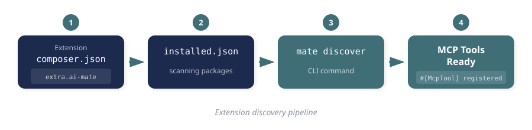
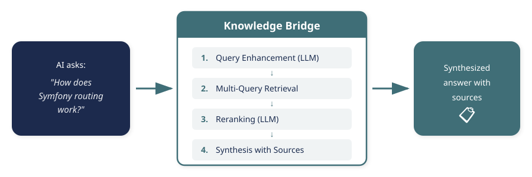

<!-- _class: teal -->

# SYMFONY MATE

<div class="subtitle">Deinem KI-Assistenten Augen geben</div>

<div class="speaker-info">Johannes Wachter mit Roland Golla — Never Code Alone | 04.08.2026</div>

---

## Der blinde Fleck

KI-Assistenten fehlt **keine Fähigkeit**. Ihnen fehlt **Kontext im richtigen Moment**.

Sie lesen deinen Code. Sie sehen nie, was deine Anwendung *tut*:

- keinen Profiler
- keine Logs
- keinen Container
- keine Service-Definitionen

Sie sehen den Bauplan. Nie das Gebäude im Betrieb.

---

## Was passiert, wenn die KI raten muss


Prompt: *„This page is slow, find the performance problem."*

Der Agent liest Controller, Entities, Repositories, Templates, Mappings,
Services, Config — **er muss das**, denn das Problem kann in jeder Schicht liegen.

---

<!-- _class: quote -->

## Warum Raten nicht skaliert

Bei 15 Dateien geht das gut. Bei tausenden nicht.

- **Nicht deterministisch** — derselbe Prompt, ein anderes Ergebnis
- **Nicht skalierbar** — jede Datei kostet Tokens, auch die, die nur Rauschen sind
- **Nicht wiederholbar** — Neustart, neue Antwort

> „Wenn du zwei Ärzte nach deiner Gesundheit fragst, bekommst du drei Antworten.
> Genau das Problem haben wir heute mit Agenten."

---

## Was Mate ist

Ein **Development-Only**-Werkzeug, das die Innenansicht einer laufenden
Symfony-App an den Assistenten gibt.

- Läuft **lokal**, auf deiner Maschine
- Hat in **Produktion nichts zu suchen** — das ist keine Warnung, das ist die Bauart
- Framework-agnostisch, Symfony ist First-Class-Citizen
- Eigener DI-Container, **getrennt** von deiner Anwendung

Deshalb hilft Mate auch dann noch, wenn dein Container *kaputt* ist —
eine fehlende Parameter-Definition legt Mate nicht lahm.

---

## Die Bausteine: Tools und Resources


- **Tools** — Fragen, die der Agent stellt: „welche Queries lief dieser Request?"
- **Resources** — Daten, die er liest: ein Profil, ein Container-Auszug, ein Log

Beides sind am Ende **PHP-Klassen**. Kein Framework im Framework.

---

<!-- _class: live-demo -->

# LIVE

## Der N+1 mit 101 Queries

`demo/` in diesem Repository

---

## Ohne Mate

Dieselbe Frage, ohne Werkzeug:

1. Der Agent crawlt das Verzeichnis
2. sucht Struktur, Framework, Controller, Entities
3. liest `index.html.twig`, `BlogController`, `PostRepository` …
4. rekonstruiert deine Anwendung **aus dem Nichts**

Er findet es. Das Beispiel ist klein genug.

**Die Frage ist nicht *ob*, sondern *wie*.**

---

## Mit Mate — drei Kommandos

```bash
composer require --dev symfony/ai-mate symfony/ai-symfony-mate-extension
vendor/bin/mate init
vendor/bin/mate discover
```

Dann eine **neue** Session — und dieselbe Frage.

Der Agent geht zum Profiler. Holt das Token. Lädt das Profil.
Sieht: **101 Queries, davon 100 identisch.**

Danach liest er *genau die* Dateien, auf die es ankommt.

---

## Warum das funktioniert hat

Der Profiler sagt dem Agenten sofort: *hier sind 100 gleiche Queries.*

Und das Schönste daran: **es sieht menschlich aus.**
Es ist derselbe Weg, den ein Symfony-Entwickler geht — erst ins Werkzeug
schauen, dann an die richtige Stelle greifen.

Nicht die ganze Anwendung von vorne verstehen. Jedes Mal aufs Neue.

---

## Eigene Extensions



Deine Domäne kennt nur **dein** Projekt. Also bring sie als Tool ein:
DI-Support, `#[McpTool]`, fertig.

Wiederverwendbar? → **MatesOfMate**: PHPUnit, PHPStan, Composer, Sulu, Database.

> Extension-Autoren bauen keine Kommandos. Sie **kuratieren Kontext.**

---

## Skills: die Wissensschicht

Ein Werkzeug zu *haben* heißt nicht zu wissen, *wann* man es einsetzt.

```markdown
---
name: symfony-profiler-debugging
description: Wann und wie der Profiler zu benutzen ist
---
<!-- der Rumpf wird erst geladen, wenn die Beschreibung trifft -->
```

- Die **Beschreibung** ist immer im Kontext — ein paar Zeilen
- Die **Anleitung** erst bei Treffer — progressive disclosure

Das Werkzeug ist das *Können*. Der Skill ist das *Wissen, wann*.

---

## Kontext ist ein Budget

MCP kostet Tokens. Jede Tool-Beschreibung, jede Antwort. Das ist wahr.

Aber die Alternative kostet **mehr**: ohne Werkzeug crawlt der Agent
Dateien, und das meiste davon ist Rauschen.

Gemessen: Mate selbst kostet rund **2.000–2.500 Tokens**.

> Sparsamkeit ist deshalb kein Feintuning, sondern ein **Designprinzip**.
> Die Qualität des Tools entscheidet, ob du gewinnst oder verschwendest.

---

## Redaction: was der Agent nicht sehen darf

Im Container liegen API-Keys. In Query-Parametern liegen Tokens.
In Log-Kontext liegen Session-Daten.

Mate redigiert **standardmäßig**, nicht auf Zuruf.

Und: neu installierte Extensions sind zwar automatisch entdeckt,
aber jederzeit abschaltbar. Du musst nicht dein halbes `vendor/`
im Auge behalten.

---

## Ausblick



- **Wissen als Extension** — Doku in der *installierten* Version, statt Raten im Netz
- **Skills als Spezifikation** — nicht nur „wie benutze ich das Tool"
- **Verteilung ohne Dependency-Konflikte** — PHAR? Etwas anderes?
- **Muss so ein Werkzeug überhaupt ein MCP-Server sein?**

---

## Die letzte Frage — offen

In Berlin stand hier noch: *„Warum MCP und nicht einfach eine CLI?"*
Antwort damals: weil die CLI den Agenten **raten** lässt — er kennt
Parameter und Ausgabeformat nicht.

Genau diese Lücke schließen **Skills**.

Wenn das stimmt, ist die Transportfrage keine Glaubensfrage mehr,
sondern eine **Messfrage**.

---

<!-- _class: teal -->

## Die Kernaussage

Wenn KI-Assistenten bei echten Software-Problemen helfen sollen,
gib ihnen nicht **mehr** Kontext.

# Gib ihnen **besseren** Kontext.

---

## Resources


### github.com/wachterjohannes/nca-mate

- **Symfony Mate** — github.com/symfony/ai
- **Berlin-Talk (Slides + Demo)** — github.com/wachterjohannes/symfony-mate-berlin
- **Giving AI Assistants Eyes** — johanneswachter.dev
- **Skills over MCP** — johanneswachter.dev
- **The wrong debate (MCP vs. CLI)** — johanneswachter.dev
- **MatesOfMate** — github.com/MatesOfMate

In diesem Repo: `demo/` = der N+1-Fall zum Mitmachen, `slides.md` = diese Folien.
